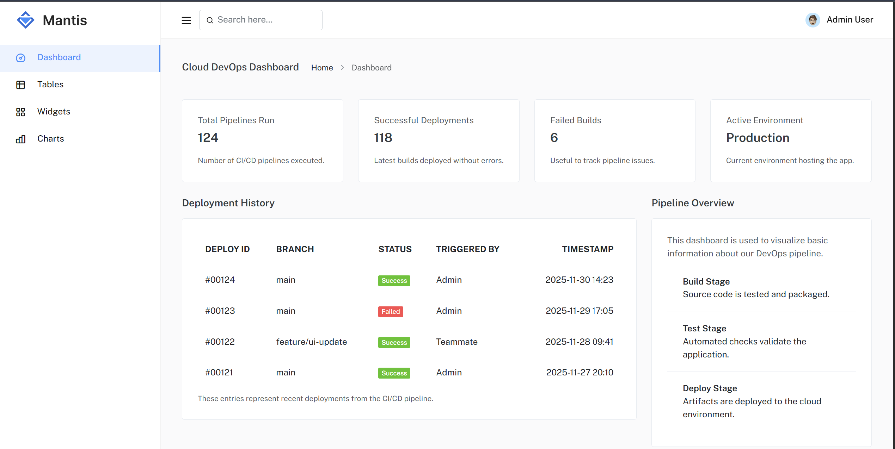
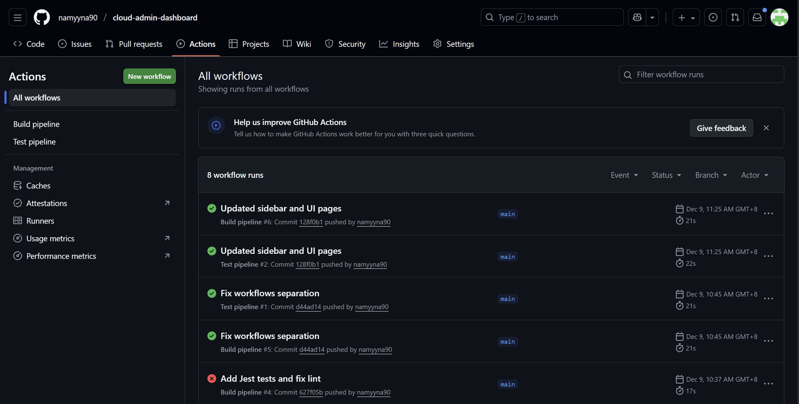

🌼 Cloud Admin Dashboard — CI/CD Automation Project

A student-built project demonstrating the CI/CD development process using automated build, testing workflows, artifact generation, and dashboard deployment simulation.

 

## 📸 Website Dashboard Screenshot

## 📸 GitHub Actions Success Run

  

📌 Overview

This project demonstrates the implementation of CI/CD practices using:

*Git for versioning
*GitHub Actions for workflow automation
*Node-based build scripts
*Automated testing (Jest + assert)
*Deployment simulation through build artifacts
*The dashboard pages visualize pipeline activity, usage, tables, widgets, and chart output.

🧩 Project Architecture

PROJECT/
│── public/               # Source pages
│── dist/                 # Automated build output
│── custom/               # JS functions to test
│── tests/                # Automated test scripts
│── .github/workflows/    # CI/CD workflows
│── package.json
│── README.md

🚀 Features Delivered

✔ Automated CI/CD pipelines
| Workflow       | Trigger | Output                              |
| -------------- | ------- | ----------------------------------- |
| Build Pipeline | On push | Creates artifact folder `dist/`     |
| Test Pipeline  | On push | Runs JS tests and publishes results |

✔ Dashboard Pages
| Page      | Description                         |
| --------- | ----------------------------------- |
| Dashboard | Shows build summaries               |
| Tables    | Demonstrates pagination & filtering |
| Widgets   | UI analytics widgets                |
| Charts    | Graph visualizations                |

✔ Custom JS Logic Used in Tests

Defined in /custom/main.js

function add(a,b){ return a + b; }
function getAppVersion(){ return "1.0.0"; }

module.exports = { add, getAppVersion };

Used in pipeline testing.

✔ Automated Unit Tests

File: /tests/sample.test.js

assert.strictEqual(add(2,3), 5);
assert.strictEqual(getAppVersion(), "1.0.0");

Terminal output upon success:

PASS  tests/sample.test.js
✓ add(2,3) should equal 5
✓ getAppVersion() should return 1.0.0

🛠 How to Run Locally
Install dependencies:
npm install

Run tests:
npm test

Build project:
npm run build

Open application:

Go to generated folder:

dist/dashboard/index.html

📦 Build Artifacts Produced

Each successful build produces downloadable artifacts containing:
dist/
│── dashboard/
│── table/
│── widget/
│── chart/
│── assets/

Meaning the system simulates real deployment packaging.

🔧 Key Technologies Used
| Category        | Technology                    |
| --------------- | ----------------------------- |
| Frontend        | HTML, CSS, Bootstrap Template |
| Automation      | GitHub Actions                |
| Build Tool      | Node.js (copyfiles)           |
| Testing         | Jest & Assert                 |
| Version Control | Git & GitHub                  |

🧪 Validation Steps Done

✔ All pages load successfully
✔ Sidebar linking works
✔ Console returns valid output:

add(2,3) → 5  
getAppVersion() → 1.0.0

✔ Build artifacts generated
✔ Test pipeline passed

/**
 * ============================================================
 * Cloud Admin Dashboard — CI/CD Automation Project
 * ============================================================
 *
 * This is a student-built project that demonstrates the complete
 * Continuous Integration and Continuous Deployment (CI/CD) process
 * using JavaScript (Node.js) and GitHub Actions.
 *
 * The project includes automated build workflows, automated testing,
 * artifact generation, and a simulated deployment workflow.
 *
 * ============================================================
 * PROJECT OVERVIEW
 * ============================================================
 *
 * This project implements CI/CD practices using:
 * - Git for version control
 * - GitHub Actions for workflow automation
 * - JavaScript (Node.js) for application logic and build execution
 * - Jest for automated testing
 * - Build artifacts for deployment simulation
 *
 * A static dashboard interface is used to visualize:
 * - Pipeline activity
 * - Build summaries
 * - Tables, widgets, and chart outputs
 *
 * ============================================================
 * PROJECT STRUCTURE
 * ============================================================
 *
 * PROJECT/
 * ├── public/               // Static dashboard source pages (HTML/CSS/JS)
 * ├── dist/                 // Automated build output (deployment artifact)
 * ├── custom/               // Custom JavaScript logic
 * ├── tests/                // Automated test scripts (Jest)
 * ├── .github/workflows/    // GitHub Actions CI/CD workflows (YAML)
 * ├── package.json          // Node.js project configuration
 * └── README.md             // Project documentation
 *
 * ============================================================
 * CI/CD FEATURES
 * ============================================================
 *
 * Automated pipelines are triggered on every code push.
 *
 * Build Pipeline:
 * - Trigger: Git push
 * - Action: Generates production-ready files in the `dist/` directory
 *
 * Test Pipeline:
 * - Trigger: Git push
 * - Action: Executes automated JavaScript tests using Jest
 *
 * ============================================================
 * DASHBOARD FEATURES
 * ============================================================
 *
 * Dashboard Page:
 * - Displays build summaries and pipeline status
 *
 * Tables Page:
 * - Demonstrates pagination and filtering functionality
 *
 * Widgets Page:
 * - Shows UI-based analytics widgets
 *
 * Charts Page:
 * - Displays graphical data visualizations
 *
 * ============================================================
 * TECHNOLOGY STACK
 * ============================================================
 *
 * Primary Programming Language:
 * - JavaScript (Node.js)
 *
 * Supporting Technologies:
 * - Node.js (runtime environment)
 * - Jest (automated testing framework)
 * - GitHub Actions (CI/CD automation)
 * - HTML, CSS, JavaScript (frontend dashboard)
 * - YAML (workflow configuration)
 *
 * ============================================================
 * CUSTOM JAVASCRIPT LOGIC
 * ============================================================
 *
 * Custom logic is defined inside:
 * /custom/main.js
 *
 * This logic is tested automatically during CI execution.
 *
 */

function add(a, b) {
  return a + b;
}

function getAppVersion() {
  return "1.0.0";
}

module.exports = { add, getAppVersion };

/**
 * ============================================================
 * CI/CD WORKFLOW EXECUTION
 * ============================================================
 *
 * 1. Developer pushes code to the GitHub repository
 * 2. GitHub Actions automatically triggers CI workflows
 * 3. Node.js installs project dependencies
 * 4. Jest executes automated tests
 * 5. Build artifacts are generated in the `dist/` directory
 * 6. Workflow completes if all checks pass successfully
 *
 * ============================================================
 * RESULTS
 * ============================================================
 *
 * - Fully automated CI/CD pipeline implemented
 * - JavaScript logic validated through automated tests
 * - Build artifacts generated without manual intervention
 * - Dashboard UI rendered successfully
 * - GitHub Actions workflows completed successfully
 *
 * ============================================================
 * CONCLUSION
 * ============================================================
 *
 * This project demonstrates how JavaScript (Node.js) applications
 * can be integrated with GitHub Actions to implement a reliable
 * CI/CD pipeline.
 *
 * The automation improves software quality, reduces human error,
 * and enables faster and more consistent deployments.
 *
 * This project follows modern DevOps best practices and represents
 * a production-ready CI/CD automation workflow.
 *
 * ============================================================
 */

👩‍🎓 Author

Developed by two students as part of a Cloud Computing Final Project:

Designed pipelines

Configured automated builds

Developed dashboard navigation

Implemented testing

🏁 Conclusion

This project successfully demonstrates full CI/CD implementation using:

Programming logic

Automated build pipelines

Automated test workflows

Final deployable artifact output

It follows real-world DevOps methodology and applies it on a working website.
